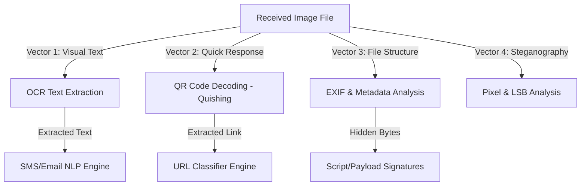

# Architectural Roadmap: Image-based Phishing & Cybersecurity Threat Detection

Attackers increasingly use images to bypass text-based spam and phishing filters. This document outlines the core threat vectors associated with image files, the required open-source libraries, and a step-by-step implementation strategy to integrate image threat analysis into **PhishShield**.

---

## 1. Core Threat Vectors in Images



### A. Screenshot Phishing (Text-in-Image)
* **The Attack:** Phishers send an image (e.g., a PNG screenshot) that looks exactly like a security alert, banking notification, or invoice. Because standard spam filters only read text strings, they ignore the image.
* **The Solution:** Use **Optical Character Recognition (OCR)** to extract all visible text from the image, and then route that text directly through your existing Email and SMS NLP models.

### B. QR Code Phishing (Quishing)
* **The Attack:** Attackers embed a malicious URL within a QR code inside the image. The user is prompted to scan it with their phone, completely bypassing workstation firewalls and endpoint security.
* **The Solution:** Programmatically extract and decode any QR codes found in the image. The decoded URL can then be analyzed using the existing URL Random Forest classifier.

### C. Steganography & Embedded Payloads
* **The Attack:** Malicious actors embed hidden scripts or executables (like PowerShell commands or reverse shell payloads) within the image pixels (using Least Significant Bit steganography) or append zip files to the end of PNG/JPG bytes (known as Polyglot files).
* **The Solution:** Scan the raw file structure, verify file headers (magic bytes), check for trailing data beyond standard EOF (End Of File) markers, and analyze EXIF metadata tag lengths.

---

## 2. Required Libraries & Tech Stack

To add image detection, you will need to add the following lightweight, industry-standard Python libraries to your `requirements.txt`:

| Library Name | Primary Purpose | Installation Command |
| :--- | :--- | :--- |
| **`pillow`** | Core image loading, pixel manipulation, and metadata extraction. | `pip install Pillow` |
| **`pytesseract`** (or `easyocr`) | Extracts textual content from screenshots and graphic cards. | `pip install pytesseract` *(Requires installing Tesseract OCR engine on host)* |
| **`pyzbar`** (or `opencv-python`) | Decodes and reads QR codes embedded inside standard images. | `pip install pyzbar` *(Requires zbar shared library)* |
| **`exifread`** | Deep extraction of EXIF metadata headers (useful for detecting payload injection). | `pip install ExifRead` |

---

## 3. Step-by-Step Implementation Plan

### Step 1: Update the Environment
Add the necessary packages to `requirements.txt`:
```text
Pillow
pytesseract
pyzbar
ExifRead
```

### Step 2: Implement the Image Processor (`src/image_processor.py`)
Create a helper script that processes an incoming image file path through three scanners:

```python
# Conceptual Structure for src/image_processor.py
import os
from PIL import Image
from pyzbar.pyzbar import decode
import pytesseract

def scan_image_threats(image_path):
    results = {
        "status": "safe",
        "qr_urls": [],
        "extracted_text": "",
        "metadata_alerts": [],
        "threat_details": []
    }
    
    # 1. Load the Image
    try:
        img = Image.open(image_path)
    except Exception as e:
        return {"status": "error", "message": f"Invalid image format: {str(e)}"}
        
    # 2. QR Code Scanner (Quishing)
    qr_codes = decode(img)
    for qr in qr_codes:
        url = qr.data.decode('utf-8')
        results["qr_urls"].append(url)
        
    # 3. OCR Text Extractor (Screenshot Phishing)
    try:
        text = pytesseract.image_to_string(img)
        results["extracted_text"] = text.strip()
    except Exception:
        pass # Tesseract not configured
        
    # 4. Basic File Structure Scan (Polyglots/Steganography)
    file_size = os.path.getsize(image_path)
    # Simple check for appended zip contents in a PNG
    with open(image_path, 'rb') as f:
        bytes_data = f.read()
        if b'PK\x03\x04' in bytes_data: # ZIP magic bytes signature
            results["metadata_alerts"].append("ZIP archive embedded inside image bytes (Polyglot threat)")
            results["status"] = "malicious"
            
    return results
```

### Step 3: Connect to Existing Classifier Engines
Create a main execution engine `src/predict_image.py` that processes the image and orchestrates the threats:
1. If **QR codes** are found: Run each extracted URL through `predict_url.py`.
2. If **Text** is found: Run the text through `predict_email.py` or `predict_sms.py` depending on length.
3. Combine all scores to issue a comprehensive threat report.
